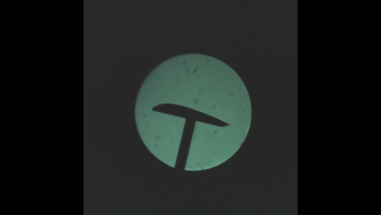

# schlieren-imaging-project

## Schlieren Imaging and Flow Visualization

Schlieren imaging is a powerful optical method to explore and visualize physical flows around objects. The basic concept involves illuminating the flow field and using a mirror or lens to concentrate the light to a focus point with a pinhole. A knife-edge barrier is placed at the focus point to cut the center of the light beam, effectively applying a Fourier transform to the optical data. By cutting the center of the focal point, we apply a high-pass filter that reveals fine differences in fluid density. This technique enables cameras to capture detailed photographs of flow patterns around objects and investigate complex fluid phenomena that would otherwise be invisible to the naked eye.
### Example Schlieren Imaging Output
Air flows over an aerodynamic shape tilted by 15 degrees

## Overview

This project combines theoretical complex analysis with computational fluid dynamics (CFD) simulations to explore flow patterns around various obstacles. It provides both analytical solutions using potential flow theory and numerical simulations using finite difference methods (FDM) for incompressible Navier-Stokes equations.

## Part I: Complex Analysis and Potential Flow Theory

The code in the `complex_analysis` folder provides:
- Classes for representing and manipulating complex numbers and shapes (circles, airfoils, prisms) in the complex plane.
- Tools for applying the Joukowski transform to generate airfoil shapes from circles.
- Visualization utilities for comparing theoretical airfoils to 3D-printed (NACA) airfoil data.
- Plotting of potential flow fields around different barriers.

### Features

- **Airfoil Comparison Plotter:** Compare the Joukowski-transformed airfoil with a real, printed airfoil shape.
- **Potential Flow Plotter:** Visualize potential flow fields around various barriers (plane, prism, cylinder, airfoil).
- **Support for custom barriers and conformal maps.**
- **Example data:** Includes a CSV file with measured airfoil coordinates.

### Example Images

#### Airfoil vs. Cylinder Example


#### Plain Prism Example


### Usage

#### Airfoil Comparison

To run the airfoil comparison plotter:

```python
from complex_analysis.examples import example_usage_airfoil_comparison
example_usage_airfoil_comparison()
```

#### Potential Flow Plotter

To visualize potential flow around different barriers:

```python
from complex_analysis.examples import example_usage_potential_flow_plotter_1, example_usage_potential_flow_plotter_2
example_usage_potential_flow_plotter_1()  # Plane vs Prism
example_usage_potential_flow_plotter_2()  # Airfoil vs Cylinder
```

## Part II: Computational Fluid Dynamics Simulations

The `simulations` folder contains a comprehensive CFD solver using finite difference methods (FDM) to simulate incompressible flow around various obstacles. The solver implements the projection method for the 2D Navier-Stokes equations.

### Features

- **Finite Difference Method (FDM) Solver:** Implements projection method for incompressible Navier-Stokes equations
- **Staggered MAC Grid:** Uses proper staggered grid for pressure-velocity coupling
- **Multiple Obstacle Types:** Support for circles, triangles, squares, and NACA airfoils
- **Real-time Visualization:** Animated velocity and pressure field visualization
- **Customizable Parameters:** Adjustable Reynolds numbers, grid resolution, and time stepping

### Obstacle Types

#### 1. Circular Cylinder - Classic Vortex Shedding


Classic von Kármán vortex street formation behind a circular cylinder at moderate Reynolds numbers.

#### 2. NACA Airfoil - Aerodynamic Flow


Flow around a NACA 0012 airfoil with angle of attack, demonstrating lift generation and boundary layer effects.


### Quick Start

To run CFD simulations, use the main demo script:

```python
# Run from project root
python main.py

# Or run specific demos
from simulations.demo_fdm import demo_circle_flow, demo_airfoil_flow
solver, plotter = demo_circle_flow()      # Circle vortex shedding
solver, plotter = demo_airfoil_flow()     # NACA airfoil aerodynamics
```

### Simulation Parameters

Each demo comes with optimized parameters for different flow regimes:

- **Circle:** Re ≈ 40, optimized for vortex shedding visualization
- **Triangle:** Sharp body flow with controlled separation
- **Airfoil:** NACA 0012 with 8° angle of attack for lift demonstration
- **Square:** Bluff body flow showing recirculation zones

### Technical Details

- **Solver:** Projection method for incompressible Navier-Stokes equations
- **Grid:** Staggered MAC (Marker-and-Cell) grid
- **Boundary Conditions:** No-slip walls, uniform inflow, natural outflow
- **Visualization:** Real-time velocity magnitude, pressure fields, and streamlines

## Data

- [complex_analysis/printed.csv](complex_analysis/printed.csv): Contains measured coordinates of a real airfoil for comparison.

## Project Structure

- `complex_analysis/`: Complex analysis and visualization tools.
    - `airfoil_comparison_plotter.py`: Airfoil comparison plotting.
    - `barrier.py`: Barrier and conformal map classes.
    - `complex_numbers.py`: Complex number utilities.
    - `complex_plane.py`: Shape representations and transforms.
    - `potential_flow_plotter.py`: Potential flow visualization.
    - `examples.py`: Example usage scripts.
    - `airfoil_cylinder_example.png`, `plain_prism_example.png`: Example output images.
    - `printed.csv`: Airfoil measurement data.

- `simulations/`: Computational fluid dynamics solvers and visualization.
    - `cfd_solver_fdm.py`: Main FDM-based CFD solver using projection method.
    - `cfd_plotter_fdm.py`: Real-time animation and visualization system.
    - `cfd_obstacles.py`: Obstacle geometry classes (circle, triangle, airfoil, square).
    - `demo_fdm.py`: Ready-to-run examples with optimized parameters.
    - `operators.py`: Finite difference operators for staggered grids.
    - `airfoil_flow.gif`, `circle_flow.gif`: Example simulation animations.

---

*For more details, see the docstrings in